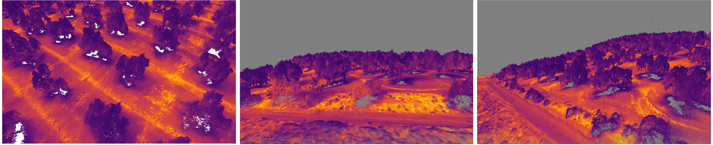
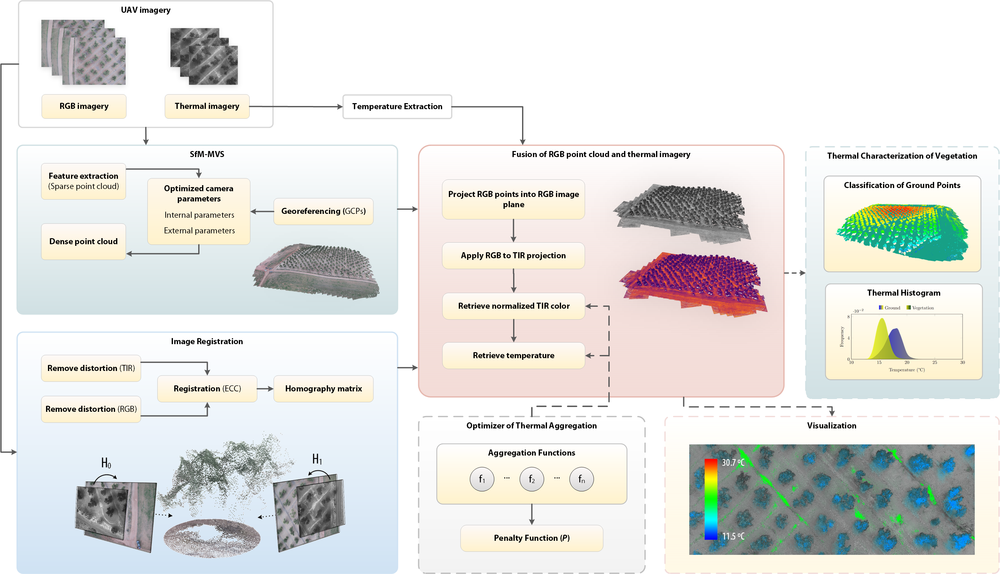
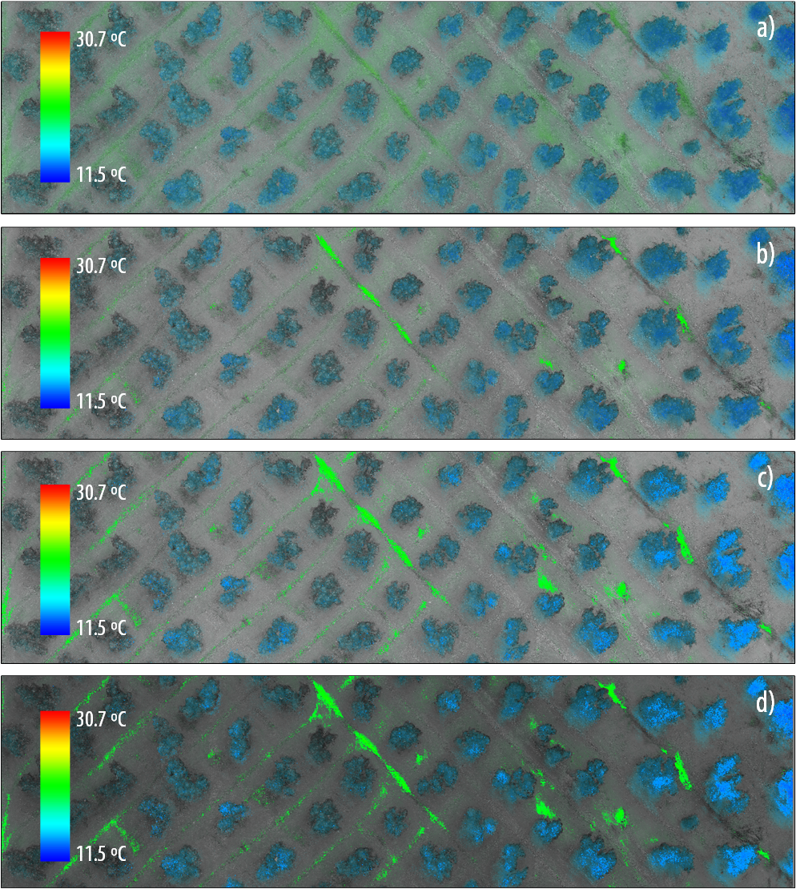

# An optimized approach for generating dense thermal point clouds from UAV imagery  
 

This source code is provided along with the manuscript entitled "An optimized approach for generating dense thermal point clouds from UAV imagery" to provide an accurate vision of the described algorithms, including those developed from previous studies. This repository is intended the provide the algoritmic core of our manuscript, rather than providing a desktop application. Therefore, the visualization framework is here omitted.

  

___
## Features

  

* Reconstruction methods are provided under *Reconstruction/* folder, including camera and point cloud representation. The controller class is given by *Environment*, whereas occlusion is based on the implementation of *ThermalAugmentation* and implemented by three subclasses (the three described occlusion approaches). Also, the classification algorithm is provided.

  

* *DataStructures* contains both BVHs and octrees. Radius octree is based on a previous work mentioned in the References, whereas the MultiInstanceBVH is an optimized approach of a conventional BVH to avoid allocating and deleting memory when it is rebuilt several times.

  

* *Shaders/* folder includes GLSL code related to the construction of a BVH, the rendering of outliers from a point cloud and ray-casting of a point cloud organized in a BVH. In addition, the normal estimation of a point cloud through SVD is included.

  

* *Utilities/* folder wraps histogram methods to analyze the distance between images and reconstructed thermal point cloud.
___
## TODO

* Complete Doxygen comments to code.

___
### Dependencies

`PCL`
`Pix4D`
`openGL: ≥ 4.5`

___
### References

This source code includes the implementation of previous research studies that are following mentioned:

> D. Meister, J. Bittner. **Parallel Locally-Ordered Clustering for Bounding Volume Hierarchy Construction**. IEEE TVCG, Volume 24, Issue 3, pages 1345-1353, 2018. DOI: https://doi.org/10.1145/3355056.3364554

> J. Behley, V. Steinhage, A.B. Cremers. **Efficient Radius Neighbor Search in Three-dimensional Point Clouds**, Proc. of the IEEE International Conference on Robotics and Automation (ICRA), 2015. DOI: 10.1109/ICRA.2015.7139702
