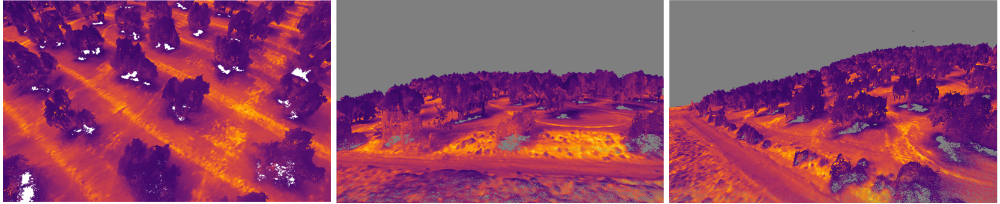
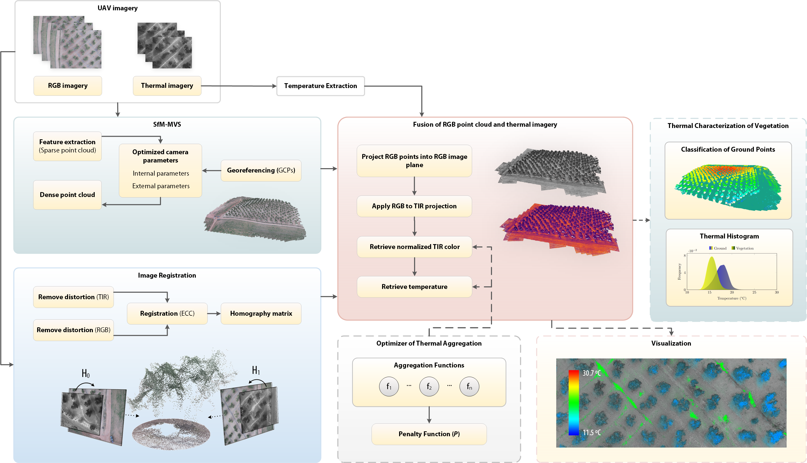
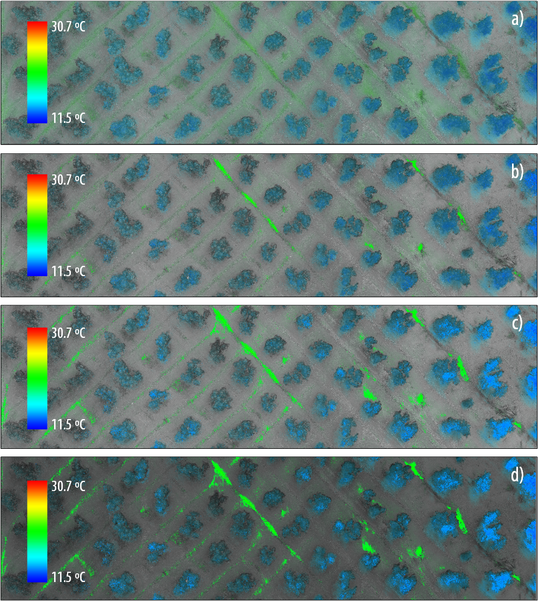

# An optimized approach for generating dense thermal point clouds from UAV imagery  
 

This source code is provided along with the manuscript entitled "An optimized approach for generating dense thermal point clouds from UAV imagery" to facilitate an accurate vision of the described algorithms, including those developed from previous studies. This repository is intended to present the algorithms described in our manuscript rather than providing a desktop application. Hence, the visualization layer is actually omitted.

  

## Features

  

* Reconstruction methods are provided under *Reconstruction/* folder, including camera and point cloud representation. The controller class is given by *Environment*, whereas occlusion is based on the implementation of *ThermalAugmentation* and implemented by three subclasses (the three described occlusion approaches). Also, the classification algorithm is provided.

  

* *DataStructures* contains both BVHs and octrees. The radius octree is based on a previous work mentioned in the References, and the MultiInstanceBVH is a conventional BVH, optimized to avoid allocating and deleting memory when it is rebuilt many times.

  

* *Shaders/* folder includes GLSL code related to the construction of a BVH, the rendering of outlier points, and ray-casting of a point cloud indexed in a BVH. We also estimate the normal vectors of a point cloud via Singular Value Decomposition (SVD).

  

* *Utilities/* folder wraps histogram methods to analyze the distance between images and the reconstructed thermal point cloud.

## How to cite

    @article{lopez_optimized_2021,
    	title = {An optimized approach for generating dense thermal point clouds from {UAV}-imagery},
    	volume = {182},
    	issn = {0924-2716},
    	url = {https://www.sciencedirect.com/science/article/pii/S0924271621002604},
    	doi = {10.1016/j.isprsjprs.2021.09.022},
    	urldate = {2023-12-31},
    	journal = {ISPRS Journal of Photogrammetry and Remote Sensing},
    	author = {López, Alfonso and Jurado, Juan M. and Ogayar, Carlos J. and Feito, Francisco R.},
    	month = dec,
    	year = {2021},
    	keywords = {GPU computing, Point cloud, Image processing, Occlusion, Thermal imagery, UAV imagery},
    	pages = {78--95},
    }
    
## TODO

* Complete Doxygen comments for the code.

### Dependencies

`PCL`
`Pix4D` (not in this repository, but for generating prior data)
`OpenGL: ≥ 4.5`

### References

We implement and include the following research papers:

> D. Meister, J. Bittner. **Parallel Locally-Ordered Clustering for Bounding Volume Hierarchy Construction**. IEEE TVCG, Volume 24, Issue 3, pages 1345-1353, 2018. DOI: https://doi.org/10.1145/3355056.3364554

> J. Behley, V. Steinhage, A.B. Cremers. **Efficient Radius Neighbor Search in Three-dimensional Point Clouds**, Proc. of the IEEE International Conference on Robotics and Automation (ICRA), 2015. DOI: https://doi.org/10.1109/ICRA.2015.7139702
